# Conversational Robot


## Requirements

In this lab, you'll use the listen, assistant, and speak nodes to train TJBot to listen to utterances, understand the natural language intents and entities, and respond by speaking out loud the response.

You will need a microphone and speaker connected to the TJBot for this lab. 

## Train TJBot to Listen, Converse, and Speak

1. In the Node-RED editor running on the Raspberry Pi, drag two  nodes onto the workspace. Double click each node and configure as shown below.

    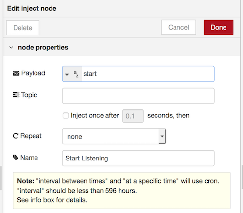

        
 
2. Add a  node as shown below. This node will take the payload from the inject nodes and set the `msg.mode` property that the listen node in the next step will use.

    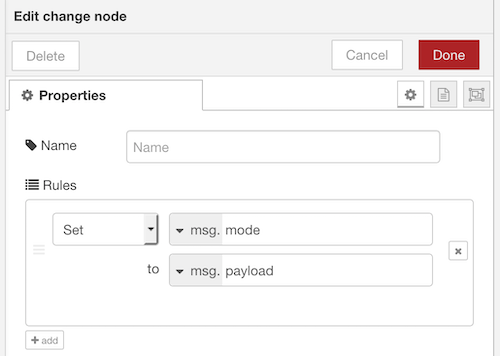
3. Add a  node as shown below. The listen node has several modes, start and stop, that can be set programmatically using the `msg.mode` property to start and stop listening. When listening is enabled, the listen node produces messages as TJBot hears and transcribes phrases, with the text being passed in the `msg.payload` property. 

    The listen node uses the Watson Speech to Text service, which requires service credentials from IBM Cloud. Click the pencil icon to the right of the **Bot** dropdown menu.

    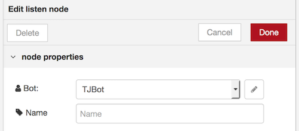

4. Click the link icon next to the **Speech to Text** heading to launch into the IBM Cloud console. Sign into your IBM Cloud account if prompted. 

    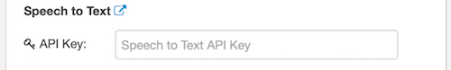

5. Leave the service name as is. Click **Create**.

    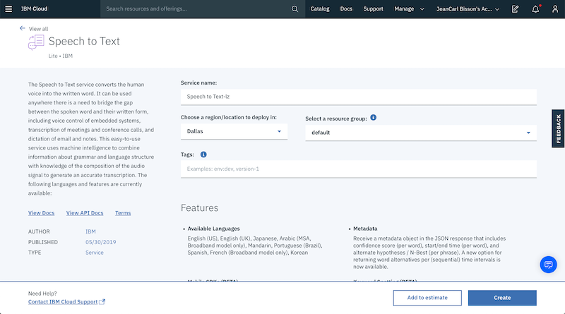

6. In the **Manage** tab, click **Show Credentials**.

    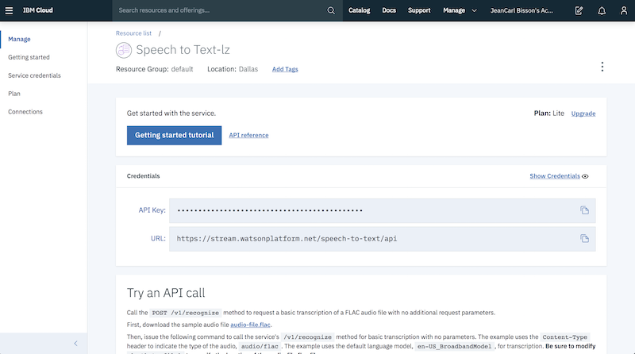

7. Copy the API Key into the field back in the Node-RED editor under the **Speech to Text** section. Ensure the location of the service instance is selected in the dropdown.

    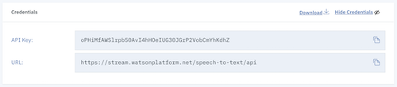

    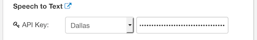

8. At the top of the configuration window, select **US English** from the **Listen** dropdown menu. Enable the microphone by ticking the checkbox labeled **Microphone**.

    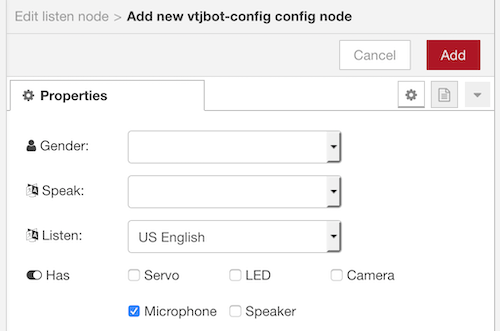
    
9. Add a  node to stop listening.

    
    
10. Next, we'll use the Watson Assistant service to analyze the text and respond. Add a  node as shown below.

    The assistant node uses the Watson Assistant service, which requires service credentials from IBM Cloud. Click the pencil icon to the right of the **Bot** dropdown menu. 
    
    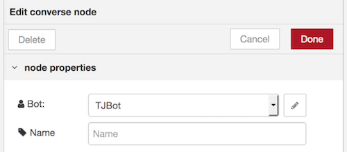

11. Click the link icon next to the **Watson Assistant** heading to launch into the IBM Cloud console and create a Watson Assistant service instance.

    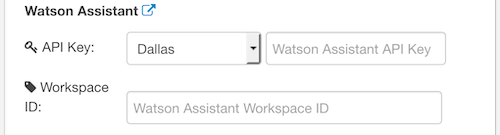

12.	Leave the service name as is. Click **Create**.

    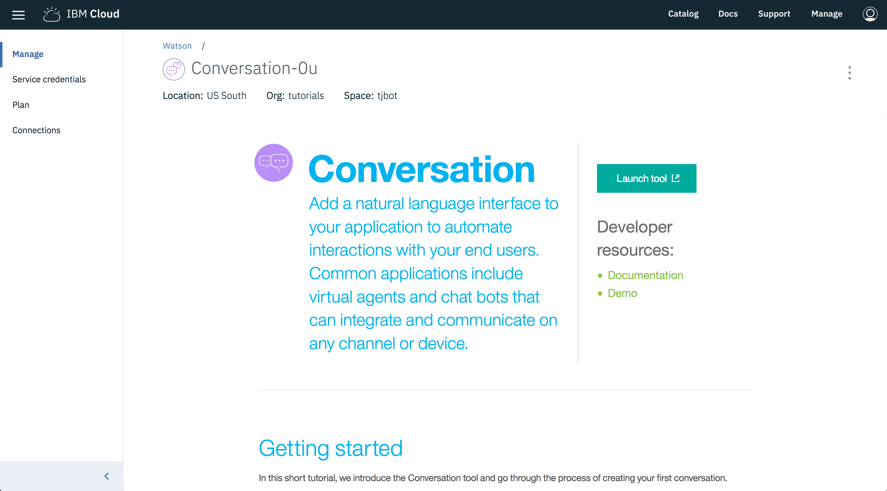

13. Click **Launch Watson Assistant** to launch into the Watson Assistant training tool.

    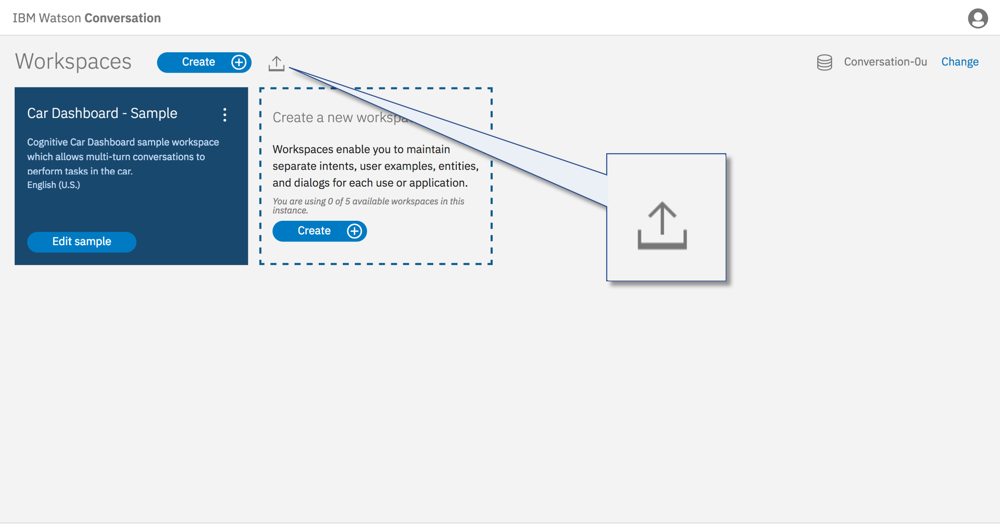

14. Click **Assistants**. Click **Create assistant**.

    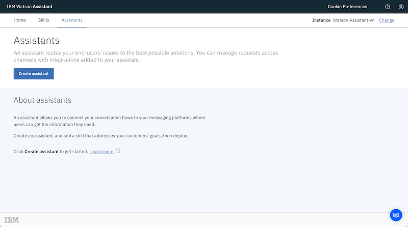

15. Give the assistant a name `Chat With TJ`. Click **Create assistant**.

    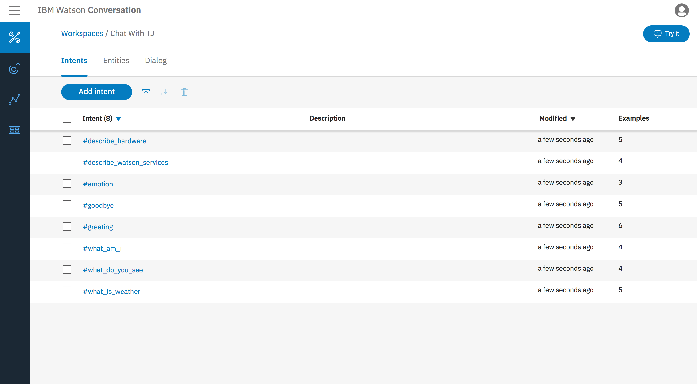    

16. Click **Add dialog skill**.

    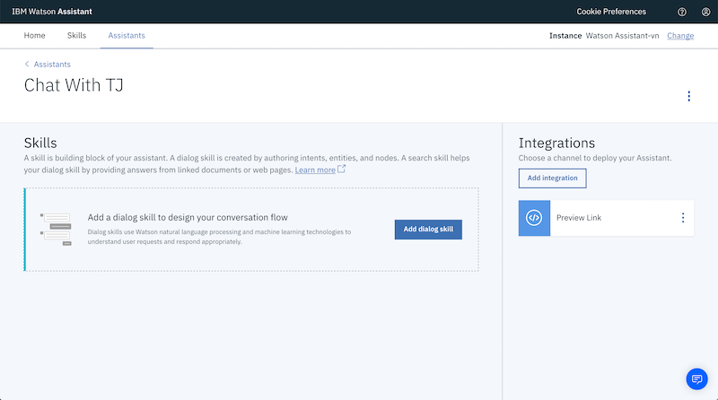

17. Click **Import Skill**. We'll use a pretrained skill. Download the file [workspace.json](https://raw.githubusercontent.com/jeancarl/tjbot-labs/master/conversational-robot/workspace.json) to your computer. Click **Choose JSON file** and select this file. Click **Import**.

    
    
18. Click the vertical elipse. Select **View API Details**. 

    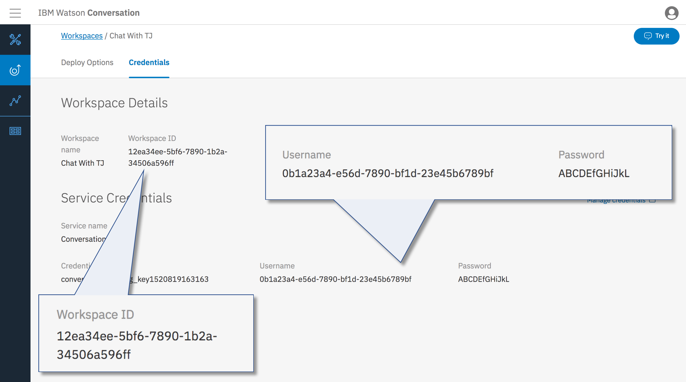

19. Copy the API Key (password) and workspace ID values into the fields under the **Watson Assistant** heading in the Node-RED editor. Ensure the location of the service instance is selected in the dropdown.

    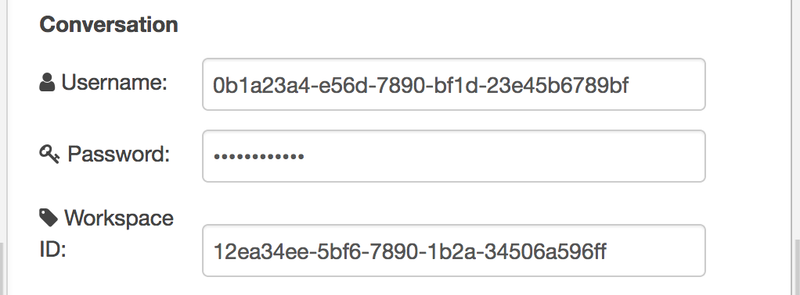
    
    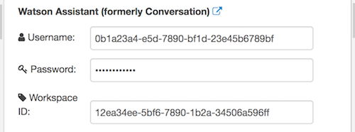    

20. Here's an example of what the `response` object looks like.

    ```
	{
	  "object": {
	    "intents": [
	      {
	        "intent": "what_am_i",
	        "confidence": 0.9035005569458008
	      }
	    ],
	    "entities": [],
	    "input": {
	      "text": "who are you?"
	    },
	    "output": {
	      "text": [
	        "I'm T J Bot. I'm an open-source project at IBM that shows you how to enable beautiful objects like me with cognitive capabilities using IBM Watson."
	      ],
	      "nodes_visited": [
	        "node_2_1520404296380"
	      ],
	      "log_messages": []
	    },
	    "context": {
	      "conversation_id": "061d3171-f911-454d-8a33-bb276985a8ff",
	      "system": {
	        "initialized": true,
	        "dialog_stack": [
	          {
	            "dialog_node": "root"
	          }
	        ],
	        "dialog_turn_counter": 8,
	        "dialog_request_counter": 8,
	        "_node_output_map": {
	          "node_11_1520406205040": [
	            0,
	            0
	          ],
	          "node_22_1520408076878": [
	            0,
	            0
	          ],
	          "node_14_1520406494007": [
	            0,
	            0
	          ],
	          "node_13_1520406331021": [
	            0,
	            0
	          ],
	          "Anything else": [
	            0
	          ],
	          "node_17_1520407499753": [
	            0,
	            0
	          ],
	          "node_2_1520404296380": [
	            0
	          ]
	        },
	        "branch_exited": true,
	        "branch_exited_reason": "completed"
	      }
	    }
	  },
	  "description": "I'm T J Bot. I'm an open-source project at IBM that shows you how to enable beautiful objects like me with cognitive capabilities using IBM Watson."
	}
    ```    

    Add a  node to move the response into the `msg.payload` property. Set `msg.payload` to the function `$join(msg.response.payload.object.output.text, " ")`.

    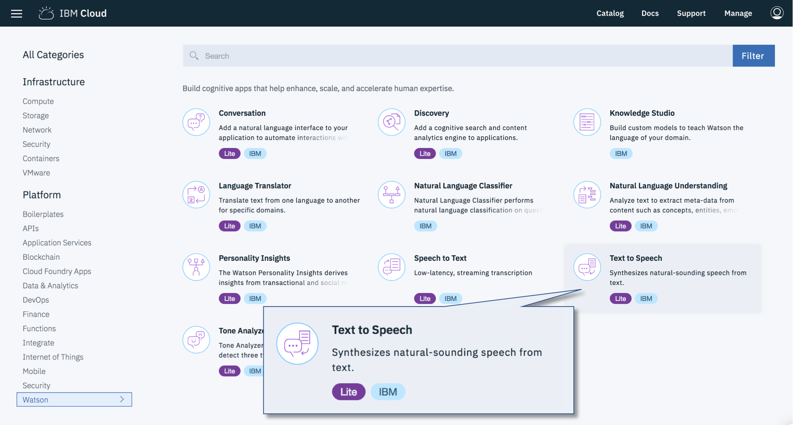

21. Finally, we'll use the Watson Text to Speech service to speak out the response. Add a  node as shown below.

    The speak node uses the Watson Text to Speech service, which requires service credentials from IBM Cloud. Click the pencil icon to the right of the **Bot** dropdown menu. 
 
    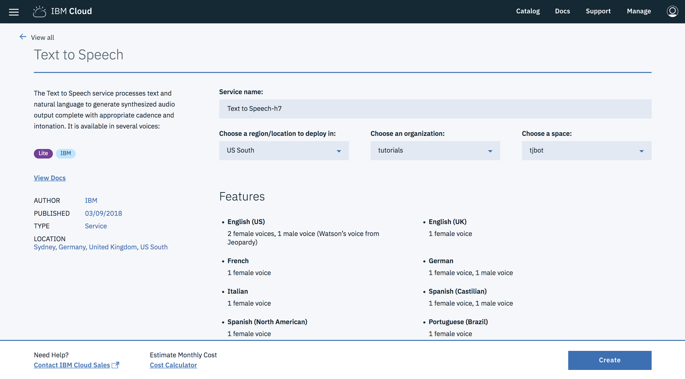

22. Click the link icon next to the **Text to Speech** heading to launch into the IBM Cloud console and create a Text to Speech service instance.

    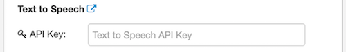

23. Leave the service name as is. Click **Create**.

    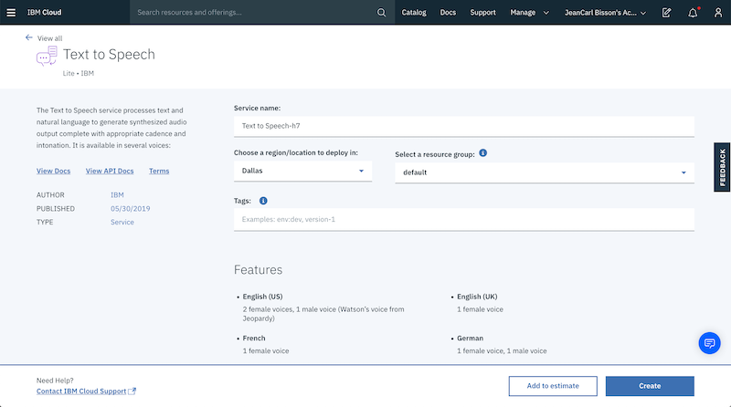

24. In the **Manage** tab, click **Show Credentials**.

    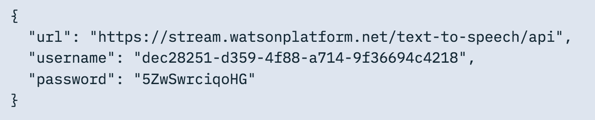

25. Copy the API Key into the field back in the Node-RED editor under the **Text to Speech** section. Ensure the location of the service instance is selected in the dropdown.

    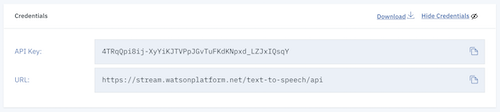

    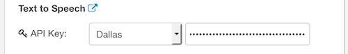

26.	Determine the Speaker Device ID by running the command `aplay -l` on the Raspberry Pi. In the example output shown below, the USB speaker attached is accessible on card `2`, device `0`.

    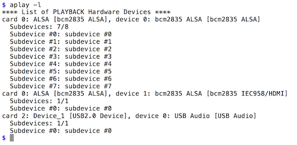

    In the TJBot configuration, enter the applicable speaker device ID, with the format `plughw:<card>,<device>`

    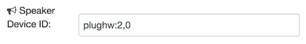

27. At the top of the configuration window, select **Male** or **Female** from the **Gender** dropdown menu. Select **English (US dialect)** from the **Speak** dropdown menu. Enable the speaker by ticking the checkbox labeled **Speaker**.

    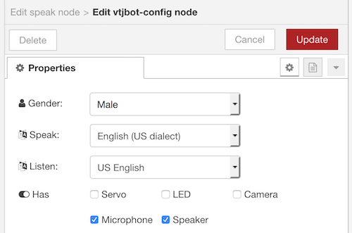

28. Connect the nodes together as shown below.

    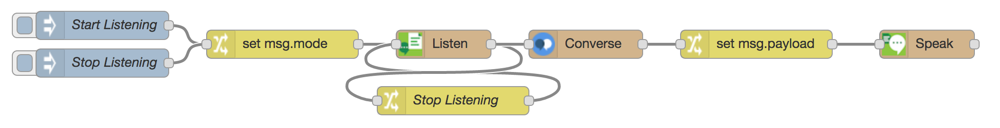 
    
29. Click the  button in the top-right corner of the Node-RED editor to save and deploy the changes.

30. Click the button to the left of the inject node labeled **Start Listening** to activate the microphone. Speak a phrase. TJBot will transcribe the audio with the Watson Speech to Text service, analyze the utterance with the Watson Assistant service, and speak out the response using the Watson Text to Speech service.
