# Conversational Robot


## Requirements

In this lab, we'll use the listen, converse, and speak methods to train TJBot to listen to utterances, understand the natural language intents and entities, and respond by speaking out the response.

You can run this lab on a physical TJBot or use the [TJBot simulator](https://ibm.biz/meet-tjbot).

If you run this lab on a physical TJBot, you will need to connect a microphone and speaker to the TJBot for this lab. There is also an extra step to configure the speaker in the section titled **Running on the Raspberry Pi** at the end of this lab.

## Train TJBot to Listen, Converse, and Speak

1. Create a file named `app.js`. Copy the following code. In the following steps, replace the `/* Step # */` placeholders with the code provided.

    ```
    var TJBot = require("tjbot");
    
    var tj = new TJBot(
      [/* Step #2 *//* Step #23 */],
      {
        /* Step #24 */
      },
      {
        /* Step #8 */
        /* Step #16 */
        /* Step #22 */
      }
    );

    /* Step #17 */

    /* Step #9 */
    ```

2. In order for TJBot to listen and transcribe audio, we first need to configure it with a microphone. The first argument to the TJBot constructor is an array of hardware available. Add `"microphone"` to this array.

    ```
    var tj = new TJBot(
      ["microphone"/* Step #23 */],
    ```

3. TJBot uses the Watson Speech to Text service from IBM Cloud to transcribe the audio. If you don't have an IBM Cloud account, sign up at [https://bluemix.net](https://bluemix.net). Sign into your account.

4. Click the **Catalog** link in the top menu of the IBM Cloud dashboard.

    


5. Click the **AI** category on the left. Click the **Speech to Text** tile.

    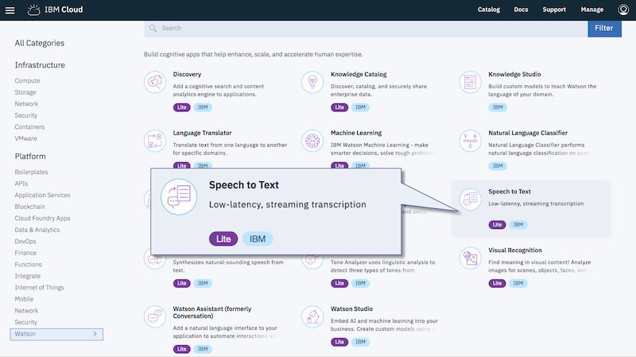

6. Leave the service name as is. Click **Create**.

    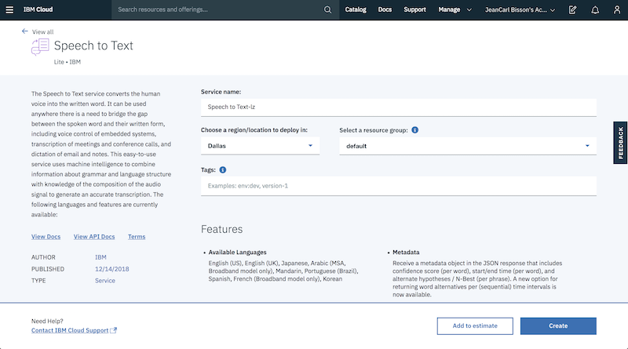

7. Click **Show Credentials**.

           

8. Replace the placeholder `/* Step #8 */` with the following code, using the username and password credentials from the previous step:

    ```
        speech_to_text: {
          username: "cf63b1f3-ef18-4628-86c8-6b1871e076b9",
          password: "MWNwz3qcdIab"
        },
    ```

    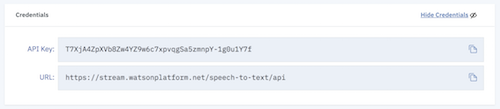    

9. Replace the placeholder `/* Step #9 */` with the following code:

    ```    
    function processText(text) {
      console.log(text);
      tj.stopListening();      

      /* Step #18 */
    }

    tj.listen(processText);    
    ```

    This will instruct TJBot to start transcribing what is heard, calling the processText function after each chunk of audio is transcribed. We also call the method `stopListening` to stop any further audio capturing.

10. Next, we'll use the Watson Assistant (formerly Watson Conversation) service to analyze the text and respond, which requires service credentials from IBM Cloud. Return to the IBM Cloud dashboard catalog and create a **Watson Assistant (formerly Conversation)** service.

    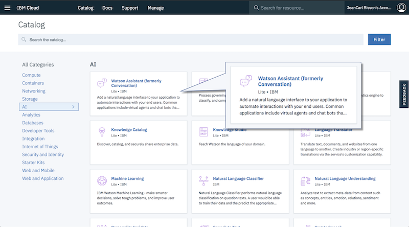

11.	Leave the service name as is. Click **Create**.

    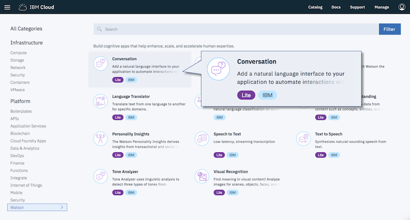

12. Click the button labeled **Launch Tool** to launch into the Watson Assistant training tool.

    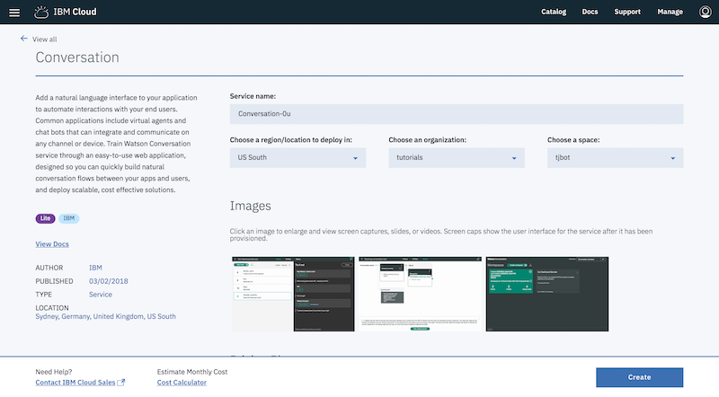

13. We'll use a pretrained workspace. Download the file [workspace.json](../workspace.json) to your computer. Click the up arrow.

    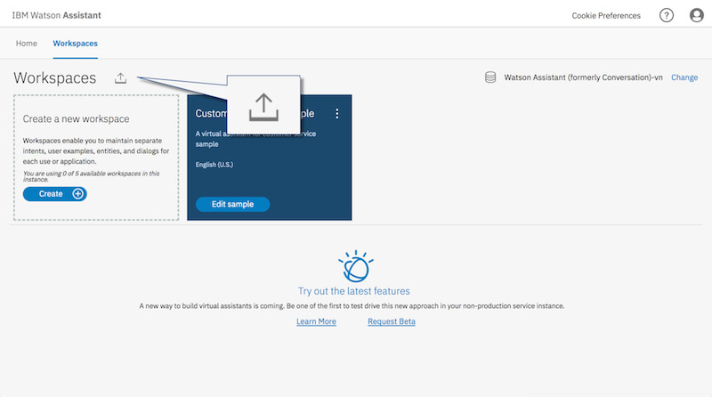

14. Click **Choose a file** and select the `workspace.json` file you downloaded. Click **Import** to create the new workspace.

    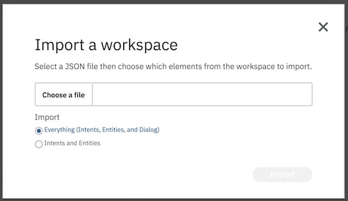    

15. The workspace has been trained with Intents, Entities, and a Dialog of responses that provide a simple conversation that the user can ask TJBot. Explore the tabs and see how an example chatbot is designed in the Watson Assistant service.

    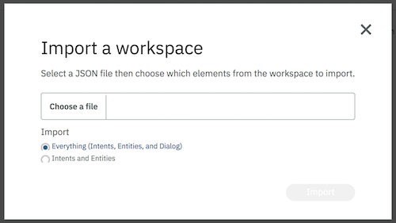    

    In order for TJBot to use the Watson Assistant service, we first need to get the service credentials and workspace ID. Click the deploy button in the left sidebar.

    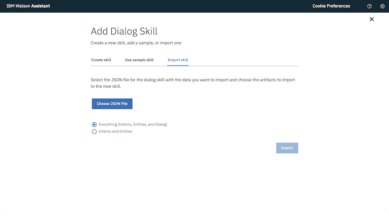    

16. Click the **Credentials** tab. 

    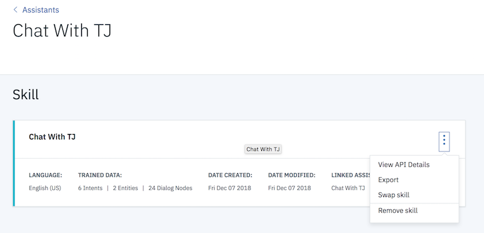
    
    Copy the username and password values. 
    
    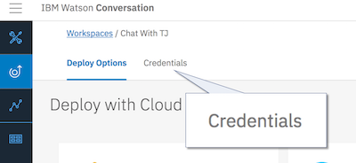

    Replace the placeholder `/* Step #16 */` with the following code, using the **Username** and **Password** credentials from the previous step:


    ```
        assistant: {
          username: "0b1a23a4-e56d-7890-bf1d-23e45b6789bf",
          password: "ABCDEfGHiJkL"
        },
    ```

17. Replace the placeholder `/* Step #17 */` with the following code, using the Workspace ID credential:

    ```
    var workspaceId = "12ea34ee-5bf6-7890-1b2a-34506a596ff";
    ```

    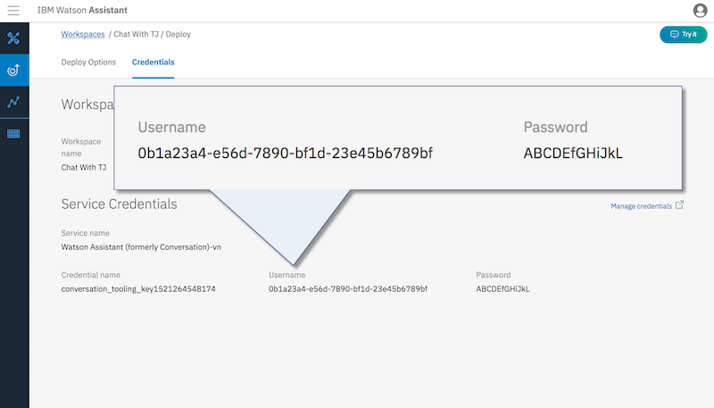

18. Replace the placeholder `/* Step #18 */` with the following code:

    ```  
      tj.converse(workspaceId, text, response => {
        console.log(response);

        /* Step #25 */
      });
    ```
    
    The transcribed text from the Watson Speech to Text service is sent to the Watson Assistant service to understand and be analyzed. Here's an example of what the `response` object looks like:

    ```
    {
      "object": {
        "intents": [
          {
            "intent": "what_am_i",
            "confidence": 0.8959802150726319
          }
        ],
        "entities": [],
        "input": {
          "text": "who are you?"
        },
        "output": {
          "text": [
            "I'm T J Bot. I'm an open-source project at IBM that shows you how to enable beautiful objects like me with cognitive capabilities using IBM Watson."
          ],
          "nodes_visited": [
            "node_2_1520404296380"
          ],
          "log_messages": []
        },
        "context": {
          "conversation_id": "7cca5aa8-6906-480c-846b-0c40c35e79a8",
          "system": {
            "dialog_stack": [
              {
                "dialog_node": "root"
              }
            ],
            "dialog_turn_counter": 1,
            "dialog_request_counter": 1,
            "_node_output_map": {
              "node_2_1520404296380": [
                0
              ]
            },
            "branch_exited": true,
            "branch_exited_reason": "completed"
          }
        }
      },
      "description": "I'm T J Bot. I'm a open-source project at IBM that shows you how to enable beautiful objects like me with cognitive capabilities using IBM Watson."
    }
    ```    

19. Return to the IBM Cloud dashboard catalog and create a **Text to Speech** service, which you will use to speak out the response.

        

20. Leave the service name as is. Click **Create**.

    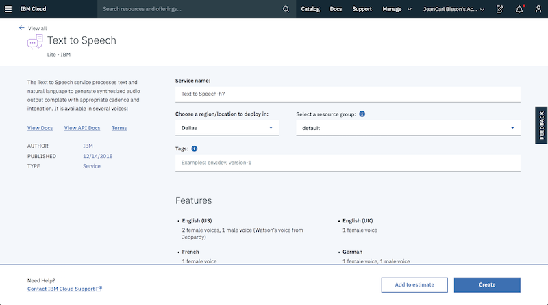

21. Click **Show Credentials**.

    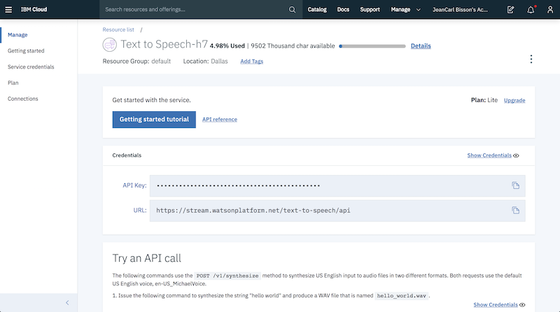    

22. Replace the placeholder `/* Step #22 */` with the following code, using the username and password credentials from the previous step:

    ```
        text_to_speech: {
          username: "dec28251-d359-4f88-a714-9f36694c4218",
          password: "5ZwSwrciqoHG"
        }
    ```

    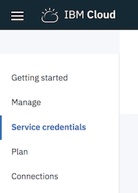

23. To configure TJBot with a speaker to play audio, add `"speaker"` to the array of the first argument to the TJBot constructor. If you're using a physical TJBot, refer to the "[Running on the Raspberry Pi](link)" section for more information about the speaker device ID.

    ```
    var tj = new TJBot(
      ["microphone","speaker"],
    ```

24. Replace the placeholder `/* Step #24 */` with the following code to configure TJBot with the gender of the voice (`male` or `female`) and what language to use (`en-US` is for the US English dialect).

    ```
        robot: {
          gender: "male"
        },
        speak: {
          language: "en-US"
        }
    ```

25. Replace the placeholder `/* Step #25 */` with the following code, which combines the response from the Watson Assistant service and uses the Watson Text to Speech service to speak out the response:

    ```
        tj.speak(response.object.output.text.join(" ")).then(() => {
          tj.listen(processText);
        });
    ```
    
    When the text has been spoken out, TJBot will resume listening for another utterance, and repeat the cycle.

26. Run the code. Speak a phrase. TJBot will transcribe the audio with the Watson Speech to Text service, analyze the utterance with the Watson Assistant service, and speak out the response using the Watson Text to Speech service.    

## Running on the Raspberry Pi

Depending on the speaker you use, you may need to specify the speaker device ID. Determine the Speaker Device ID by running the command `aplay -l` on the Raspberry Pi. In the example output shown below, the USB speaker attached is accessible on card `2`, device `0`.

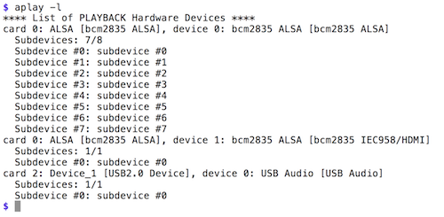

In the TJBot configuration, use the applicable speaker device ID, with the format `plughw:<card>,<device>`.

```
    speak: {
      language: "en-US",
      speakerDeviceId: "plughw:2,0"
    }
```

## Completed Code

The completed Node.js program is shown below.

```
var TJBot = require("tjbot");

var tj = new TJBot(
  ["microphone","speaker"],
  {
    robot: {
      gender: "male"
    },
    speak: {
      language: "en-US"
    }
  },
  {
    speech_to_text: {
      username: "",
      password: ""
    },
    assistant: {
      username: "",
      password: ""
    },
    text_to_speech: {
      username: "",
      password: ""
    }    
  }
);

var workspaceId = "";

function processText(text) {
  console.log(text);
  tj.stopListening();

  tj.converse(workspaceId, text, response => {
    console.log(response);

    tj.speak(response.object.output.text.join(" ")).then(() => {
      tj.listen(processText);
    });
  });
}

tj.listen(processText);
```
