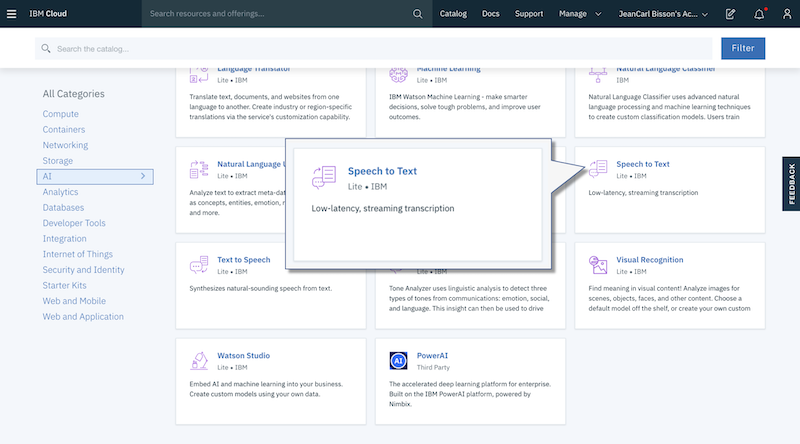
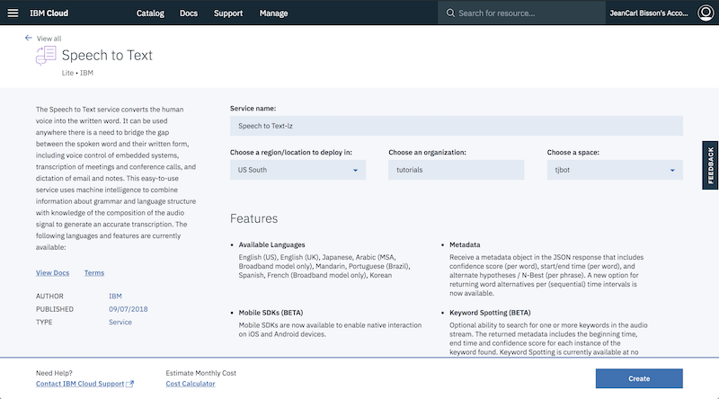
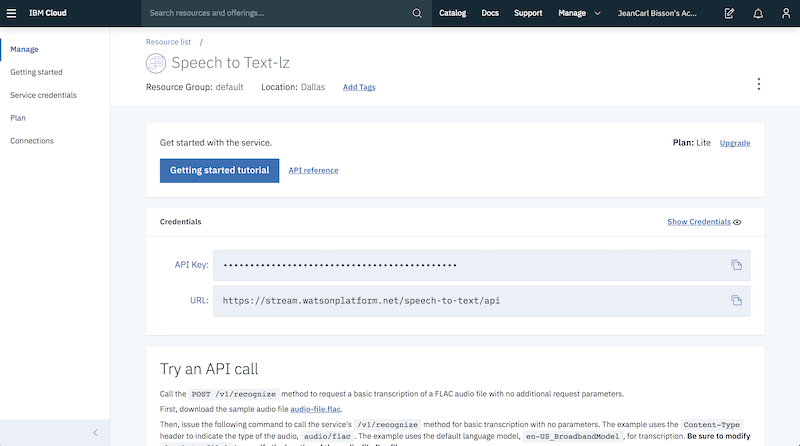
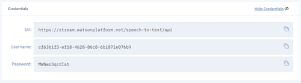
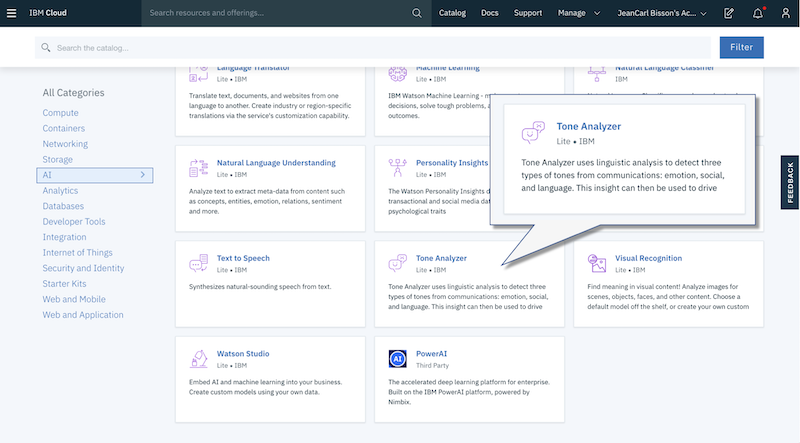
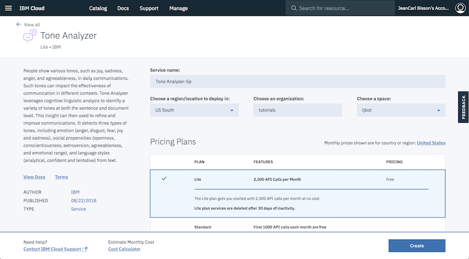
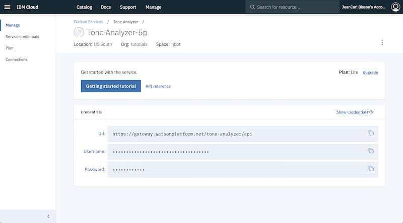
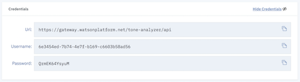
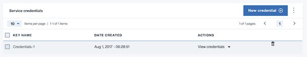

# Emotional LED Light


## Requirements

In this lab, we'll use the listen and analyze tone methods to train TJBot to listen to utterances and analyze the emotion, shining an LED light based on which emotion is most prevalent. 

You can run this lab on a physical TJBot or use the [TJBot simulator](https://ibm.biz/meet-tjbot).

If you run this lab on a physical TJBot, you will need to connect a microphone and LED to the TJBot for this lab. 

## IBM Cloud Account

You will need a IBM Cloud account to create the IBM Watson services used in this lab. Please visit [ibm.biz/start-tjbot-lab](https://ibm.biz/start-tjbot-lab) to register for and log into your IBM Cloud.

## Train TJBot to Listen and React to Emotions

1. Create a file named `app.js`. Copy the following code. In the following steps, replace the `/* Step # */` placeholders with the code provided. 

    ```
    var TJBot = require("tjbot");
    
    var tj = new TJBot(
      [/* Step #2 *//* Step #15 */], 
      {}, 
      {
        /* Step #8 */
        /* Step #13 */
      }
    );
    
    /* Step #9 */
    ```
    
2. In order for TJBot to listen and transcribe audio, we first need to configure it with a microphone. The first argument to the TJBot constructor is an array of hardware available. Add `"microphone"` to this array.

    ```
    var tj = new TJBot(
      ["microphone"],
    ```

3. TJBot uses the Watson Speech to Text service from IBM Cloud to transcribe the audio. If you don't have an IBM Cloud account, sign up at [https://bluemix.net](https://bluemix.net). Sign into your account. 

4. Click on the **Catalog** link in the top right corner of the IBM Cloud dashboard. 

    
    

5. Click on the **Watson** category on the left. Click on the **Speech to Text** tile.

    

6. Leave the service name as is and click **Create**.

    

7. Click on **Service Credentials** in the menu on the left. If there are no credentials in the list, click **New credential** and **Add** to create a set of credentials. Click on **View Credentials** to display the service credentials.

    	    
    	        

8. Replace the placeholder `/* Step #8 */` with the following code. Use your own API key from the previous step. 

    ```
        speech_to_text: { 
          username: "cf63b1f3-ef18-4628-86c8-6b1871e076b9",
          password: "MWNwz3qcdIab"
        }, 
    ```
    
        

9. Replace the placeholder `/* Step #9 */` with the following code. 
This will instruct TJBot to start transcribing what is heard, calling the processText function after each chunk of audio is transcribed.
    
    ```    
    function processText(text) {
      console.log(text);
      
      /* Step #14 */
    }
    
    tj.listen(processText);    
    ```

10. Next, we'll train TJBot to analyze the emotion of these utterances using the Watson Tone Analyzer service, which requires service credentials from IBM Cloud. Return to the IBM Cloud dashboard catalog and create a **Watson Tone Analyzer** service.

    

11.	Leave the service name as is and click **Create**.

    

12.	Click on **Service Credentials** in the menu on the left. If there are no credentials in the list, click **New credential** and **Add** to create a set of credentials. Click on **View Credentials** to display the service credentials.

    	
        

13. Replace the placeholder `/* Step #13 */` with the following code. Use your own username and password credentials from the previous step. 

    ```
        tone_analyzer: {
          username: "6e3454ed-7b74-4e7f-b169-c6603b58ad56",
          password: "QrmEK64YsyuM"
        }
    ```

       

14. Replace the placeholder `/* Step #14 */` with the following code. This code extracts out the emotion that is most prevalent in the utterance.

    ```
      tj.analyzeTone(text).then(response => {
        console.log(response);
        
        var emotions = response.document_tone.tone_categories[0].tones;
        var top = emotions[Object.keys(emotions).reduce((a, b) => {
          return emotions[a].score > emotions[b].score ? a : b
        })];
        console.log(top);
        
        /* Step #16 */
      });
    ```     

15. In order for TJBot to shine a color, we need to configure it with a LED. Add `"led"` to the array of the first argument to the TJBot constructor.

    ```
    var tj = new TJBot(
      ["microphone","led"], 
    ```

16. Replace the placeholder `/* Step #16 */` with the following code. This code maps each emotion to a color: anger (red), disgust (green), fear (magenta), joy (yellow) and sadness (blue).

    ```
        var colors = {
          "anger": "red",
          "disgust": "green",
          "fear": "magenta",
          "joy": "yellow",
          "sadness": "blue"  
        };
            
        tj.shine(colors[top.tone_id]);
      
    ```      

17. Run the code. Speak a phrase. TJBot will transcribe the audio with the Watson Speech to Text service, analyze the emotions with the Watson Tone Analyzer service, and shine a corresponding LED color representing one of the emotions.

## Completed Code

The completed Node.js program is shown below.

```
var TJBot = require("tjbot");

var tj = new TJBot(
  ["microphone","led"], 
  {}, 
  {
    speech_to_text: {
      username: "",
      password: ""
    },
    tone_analyzer: {
      username: "",
      password: ""
    }
  }
);

function processText(text) {
  console.log(text);
  
  tj.analyzeTone(text).then(response => {
    console.log(response);
    
    var emotions = response.document_tone.tone_categories[0].tones;
    var top = emotions[Object.keys(emotions).reduce((a, b) => {
        return emotions[a].score > emotions[b].score ? a : b
    })];
    console.log(top);
    
    var colors = {
      "anger": "red",
      "disgust": "green",
      "fear": "magenta",
      "joy": "yellow",
      "sadness": "blue"  
    };
    
    tj.shine(colors[top.tone_id]);
  });
}

tj.listen(processText);
```

## IBM Coder Challenge

When you complete this lab, visit the [IBM Coder challenge](https://ibm-coder-tjbot) to earn credit.

## Notes

This lab uses the TJBot Node.js library which uses an older version of the Tone Analyzer. As of September 25th 2017 (service version: 3.4.1, interface version: 2017-09-21), the Tone Analyzer service no longer returns the emotion disgust. 