# Say What I See

## Requirements

In this lab, we'll use the see and speak nodes to train TJBot to recognize objects and speak what is seen. You will need a Raspberry Pi camera and speaker connected to the TJBot for this lab. 

## Train TJBot to See Objects and Speak

1. In the Node-RED editor running on the Raspberry Pi, drag an  node onto the canvas. Double click the node and configure as shown below.

    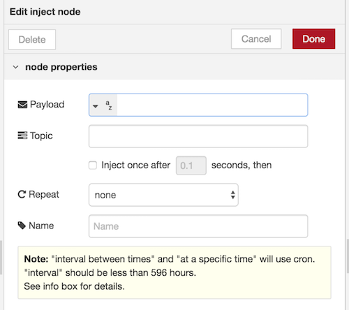

2. Add a  node as shown below. The see node has several modes: recognize text, recognize objects, and take a photo. Select **See (identify objects)** from the **Mode** dropdown menu.

    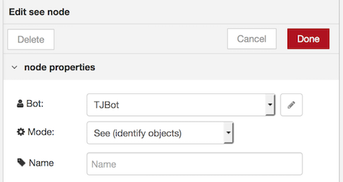
    
    The see node uses the Watson Visual Recognition service, which requires service credentials from IBM Cloud. Click the pencil icon to the right of the **Bot** dropdown menu. 

3. Click the link icon next to the **Visual Recognition** heading to launch into the IBM Cloud console and create a Watson Visual Recognition service instance.

    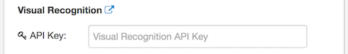
4. If you don't have an IBM Cloud account, sign up for an account. Sign into your account if prompted. Leave the service name as is. Click **Create**.

    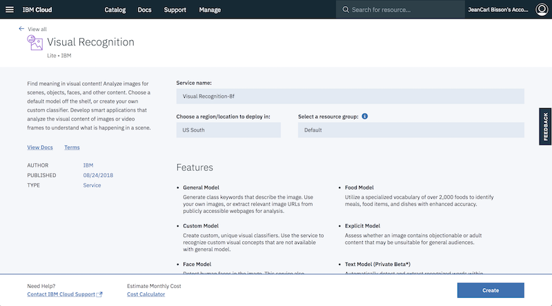

5. Click **Show Credentials**.

    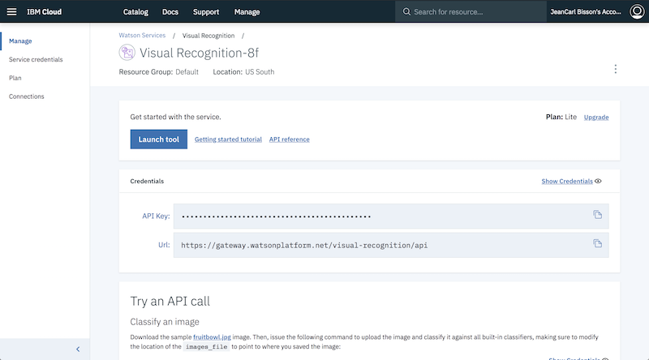	

6. Copy the IAM API key into the field back in the Node-RED editor under the **Visual Recognition** section. 

    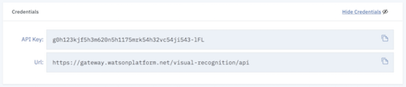
    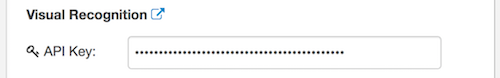
    
    **Note**: Visual Recognition service instances created before May 23, 2018 use a different authentication mechanism. Copy the API key into the API Key field instead.     
	
7. Enable the camera by ticking the checkbox labeled **Camera**. 

    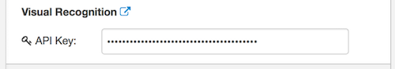

8.	The see node produces a message with names of objects and colors in the photo analyzed, with the response being passed in the `msg.payload` property. Add a  node to loop through the results and concatenate them into a new message.

    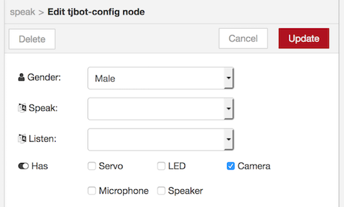

9.	Add a  node as shown below. The speak node uses the Watson Text to Speech service, which requires service credentials from IBM Cloud. Click the pencil icon to the right of the **Bot** dropdown menu. 

    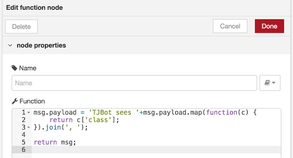

10.	Click the link icon next to the **Text to Speech** heading to launch into the IBM Cloud console and create a Watson Text to Speech service instance.

    

11.	Leave the service name as is. Click **Create**.

    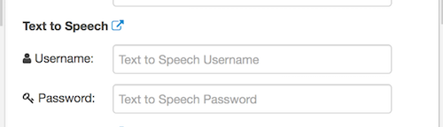

12.	Click **Show Credentials**.

    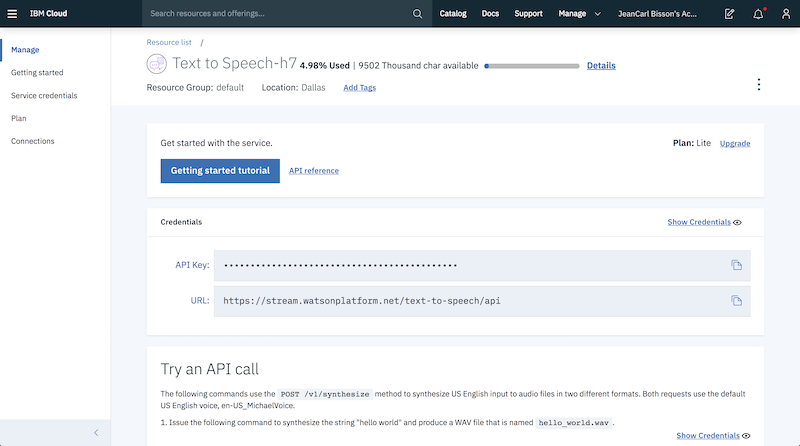	

13.	Copy the username and password into the fields back in the Node-RED editor under the **Text to Speech** section.

    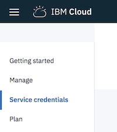    

    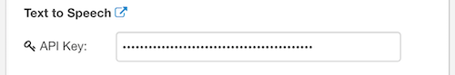
14.	Determine the Speaker Device ID by running the command `aplay -l` on the Raspberry Pi. In the example output shown below, the USB speaker attached is accessible on card `2`, device `0`.

    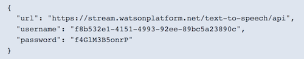

    In the TJBot configuration, enter the applicable speaker device ID, with the format `plughw:<card>,<device>`

    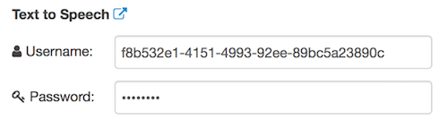

15. At the top of the configuration window, select **Male** or **Female** from the **Gender** dropdown menu. Select **English (US dialect)** from the **Speak** dropdown menu. Enable the speaker by ticking the checkbox labeled **Speaker**. 
 
    

16.	Connect the nodes together as shown below.

    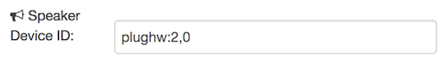

17.	Click the  button in the top-right corner of the Node-RED editor to save and deploy the changes.

18.	Click the tab to the left of the inject node to take a picture with TJBot's camera. When the photo is analyzed with the Watson Visual Recognition service, a message is constructed with the objects and colors recognized, and is spoken out via the speaker.

    An example is:

    `TJBot sees earphone, person, face, people, maroon color`
