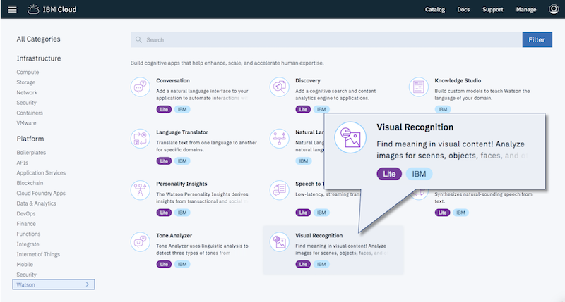
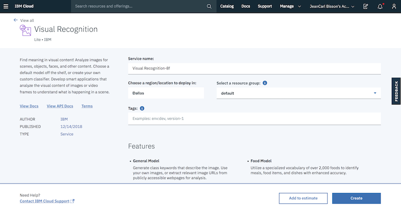
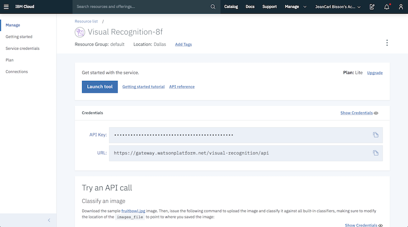
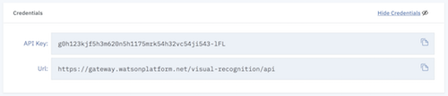
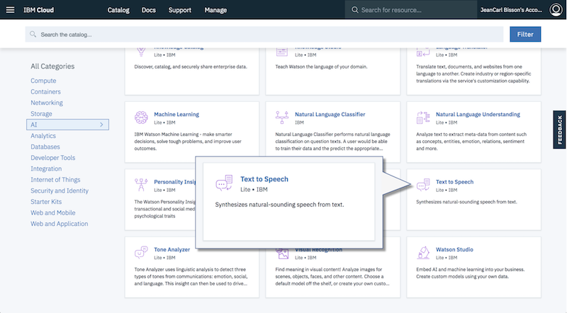
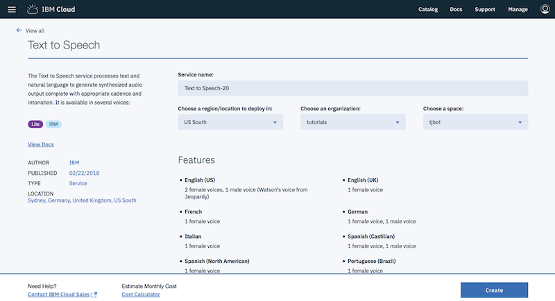
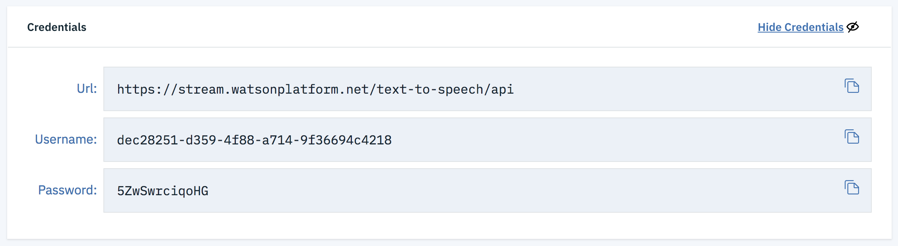

# Say What I See


## Requirements

In this lab, you'll use the see and speak capabilities to train TJBot to recognize objects and speak out loud what is seen. You can run this lab on a physical TJBot or use the [TJBot simulator](https://ibm.biz/meet-tjbot).

If you run this lab on a physical TJBot, you will need to connect a Raspberry Pi camera and speaker to the TJBot for this lab. There is also an extra step to configure the speaker in the section titled **Running on the Raspberry Pi** at the end of this lab.

## Train TJBot to See Objects and Speak

1. Create a file named `app.js`. Copy the following code. In the following steps, we'll replace the /* Step # */ placeholders with code. 

    ```
    var TJBot = require("tjbot");
    
    var tj = new TJBot(
      [/* Step #2 *//* Step #16 */], 
      {
        /* Step #15 */
      }, 
      {
        /* Step #8 */
        /* Step #14 */
      });
        
    /* Step #9 */
    ```
    
2. For TJBot to take a picture, we first need to configure it with a camera. The first argument to the TJBot constructor is an array of hardware available. Add `"camera"` to this array.

    ```
    var tj = new TJBot(
      ["camera"],
    ```

3. TJBot uses the Watson Visual Recognition service from IBM Cloud to classify objects and colors in the picture. 

4. Click the **Catalog** link in the top menu of the IBM Cloud dashboard. Sign into your IBM Cloud account. 

    
    

5. Click the **AI** category on the left. Click the **Visual Recognition** tile.

    

6. Leave the service name as is. Click **Create**.

    

7. Click **Show Credentials**.

    	    

8. Replace the placeholder `/* Step #8 */` with the following code. Use your own API key from the previous step. 

    ```
      visual_recognition: {
        apikey: "U_LmcgJFHIFFlUx1v6Jym-8JVgOXdC0P2hWck4WfVt8U-lFL"
      },   
    ```
    
        

9. Replace the placeholder `/* Step #9 */` with the following code. 
This will instruct TJBot to take a photo and return an array of objects and colors. 
    
    ```    
    tj.see(objects => {
      console.log(objects);
          
      /* Step #10 */
          
      /* Step #17 */
    });    
    ```

    The see method produces an array with names of objects and colors in the photo analyzed. Here's what an example response looks like:

    ```
    [
      {
        "class": "person",
        "score": 0.865
      },
      {
        "class": "indigo color",
        "score": 0.613
      },
      {
        "class": "gray color",
        "score": 0.576
      }
    ]
    ```

10. Replace the placeholder `/* Step #10 */` with the following code that loops through this result and concatenates the items into one string.
    
    ```
      var text = "T J Bot sees " + objects.map(item => item["class"]).join(", ");
      console.log(text);
    ```

11. Next, we'll train TJBot to speak out this string using the Watson Text to Speech service, which requires service credentials from IBM Cloud. Return to the IBM Cloud dashboard catalog and create a Text to Speech Watson service.

    

12.	Leave the service name as is. Click **Create**.

    

13.	Click **Show Credentials**.

    	

14. Replace the placeholder `/* Step #14 */` with the following code. Use your own API key from the previous step. 
 

    ```
    text_to_speech: {
      apikey: "q5wt6VlBi5IuljwK-vbI8sCwkQrHCaAYNXeftnwCJilc"
    }
    ```

       

15. Replace the placeholder `/* Step #15 */` with the following code. Configure TJBot with the gender of the voice (`male` or `female`) and what language to use (`en-US` is for the US English dialect). 

    ```
    robot: {
      gender: "male" 
    },
    speak: {
      language: "en-US" 
    }
    ```     

16. In order for TJBot to play audio, we need to configure it with a speaker. Add `"speaker"` to the array of the first argument to the TJBot constructor. If you're using a physical TJBot, please refer to the section below titled **Running on the Raspberry Pi** for more information about the speaker device ID.

    ```
    var tj = new TJBot(
      ["camera","speaker"], 
    ```
    
17. Replace the placeholder `/* Step #17 */` with the following code. This will instruct TJBot to speak out the value of the variable text (the concatenated list of objects and colors it sees).

    ```
      tj.speak(text);
    ```

18. Run the code. When a photo is taken, it is analyzed with the Watson Visual Recognition service, a message is constructed with the objects and colors recognized, and is spoken out via the speaker.

    An example is:

    `TJBot sees earphone, person, face, people, maroon color`

## Running on the Raspberry Pi

Depending on the speaker you use, you may need to specify the speaker device ID. Determine the Speaker Device ID by running the command `aplay -l` on the Raspberry Pi. In the example output shown below, the USB speaker attached is accessible on card `2`, device `0`.


In the TJBot configuration, use the applicable speaker device ID, with the format `plughw:<card>,<device>`

```
    speak: {
      language: "en-US",
      speakerDeviceId: "plughw:2,0" 
    }
```

## Completed Code

The completed Node.js program is shown below.

```
var TJBot = require("tjbot");

var tj = new TJBot(
  ["camera","speaker"], 
  {
    robot: {
      gender: "male"
    },
    speak: {
      language: "en-US"
    }
  }, 
  {
    visual_recognition: {
      apikey: ""
    },
    text_to_speech: {
      apikey: ""
    }
  });
    
tj.see(objects => {
  console.log(objects);
  
  var text = "T J Bot sees " + objects.map(item => item["class"]).join(", ");
  console.log(text);
  
  tj.speak(text);
});
```